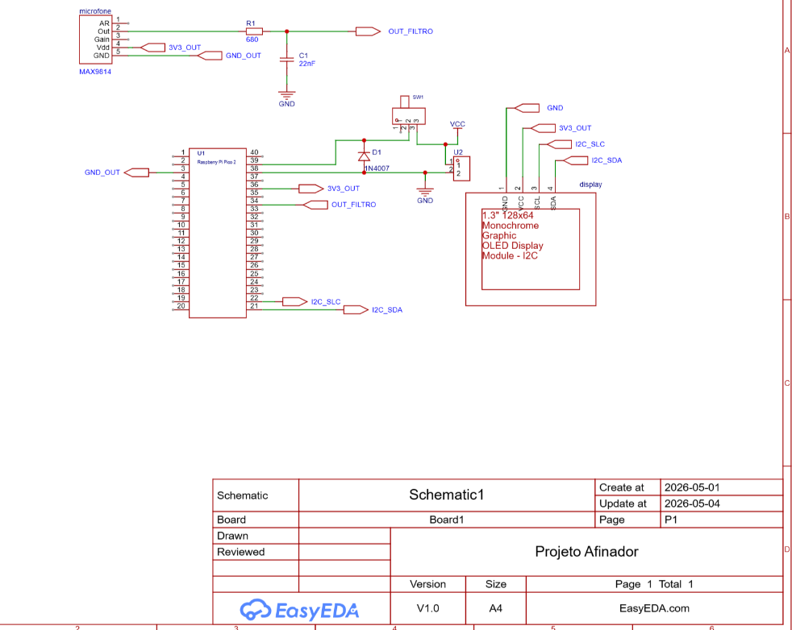
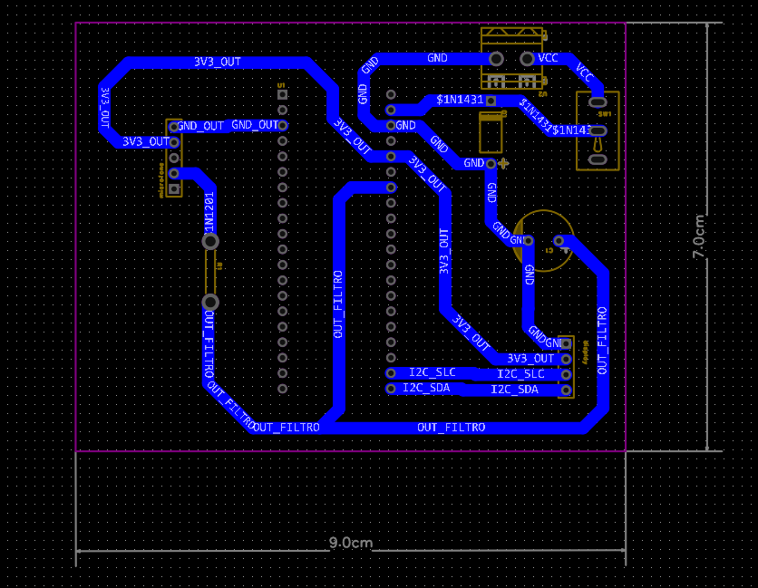

<div align="center">

```
███████╗███████╗███╗   ██╗    ██████╗ ███████╗ ██╗
██╔════╝██╔════╝████╗  ██║    ╚════██╗██╔════╝███║
█████╗  █████╗  ██╔██╗ ██║     █████╔╝███████╗╚██║
██╔══╝  ██╔══╝  ██║╚██╗██║    ██╔═══╝ ╚════██║ ██║
███████╗███████╗██║ ╚████║    ███████╗███████║ ██║
╚══════╝╚══════╝╚═╝  ╚═══╝    ╚══════╝╚══════╝ ╚═╝
```

# EEN251 — Microcontroladores e Sistemas Embarcados

**Engenharia de Computação · Mauá Institute of Technology**

[](.)
[](.)
[](.)
[](.)
[](.)
[](.)
[](.)
[](.)

> *"Embedded systems are everywhere — they just don't announce themselves."*

</div>

---

## 1. ◈ Equipe

<div align="center">

| Nome | RA | Papel |
|------|----|-------|
| Enzo Oliveira D'Onofrio | 23.01561-6 | Desenvolvedor |
| Leonardo Souza Olivieri | 23.01512-8 | Desenvolvedor |
| Arthur Gama Ruiz | 23.01445-8 | Desenvolvedor |
| João Vitor Morimoto Sesma | 23.01516-0 | Desenvolvedor |
| Pedro Wilian Palumbo Bevilacqua | 23.01307-9 | Desenvolvedor |

**Orientadores**

Prof. Sergio Ribeiro Augusto · Prof. Rodrigo de Marca França

</div>

---

## 2. ◈ Descrição Geral do Projeto
Desenvolvimento de um afinador de violão embarcado utilizando a Raspberry Pi Pico 2. O sistema captura o sinal sonoro via microfone, realiza análise de frequência em tempo real e indica ao usuário se a corda está afinada, acima ou abaixo da nota alvo — tudo rodando bare-metal em C.

- [ ] Definição do escopo e proposta
- [ ] Captura de áudio via ADC
- [ ] Algoritmo de detecção de frequência (ex: FFT / autocorrelação)
- [ ] Mapeamento das frequências das cordas (E2, A2, D3, G3, B3, E4)
- [ ] Feedback visual ao usuário (display / LEDs)
- [ ] **Apresentação T1**

---

## 3. Estrututa do repositório

```bash
EEN251/
│
├── images/                      # Imagens utilizadas no README
│   ├── pcb.png                  # Layout/PCB do circuito
│   └── esquema_eletrico.png     # Esquema elétrico do projeto
│
├── T1-afinador-violao/          # Raspberry Pi Pico 2 — Afinador de violão
│   ├── tests/                   # Código de testes em MicroPython                    
│   ├── README.md
├── README.md
```

---

## 4. Materiais e Componentes

| Qtd | Componente | Finalidade | Preço Est. (R$) |
|-----|------------|------------|-----------------|
| 1 | Raspberry Pi Pico 2 | Microcontrolador principal do sistema | 45,00 |
| 1 | Sensor de Som MAX9814 (AGC) | Captura e amplificação do sinal de áudio do violão | 18,00 |
| 1 | Display OLED HW-239A | Exibição das informações de afinação | 20,00 |
| 1 | Diodo 1N4007 | Proteção contra inversão de polaridade | 1,00 |
| 1 | Capacitor 22 nF | Filtragem e estabilização do sinal elétrico | 1,00 |
| 1 | Chave Toggle (3 terminais) | Liga/desliga e controle de alimentação | 6,00 |
| 1 | Resistor 680 Ω | Limitação de corrente no circuito | 0,50 |
| 1 | Conector para bateria | Conexão da fonte de alimentação | 4,00 |
| 1 | Bateria LiPo 3,7 V 1000 mAh (18650) | Alimentação portátil do sistema | 25,00 |
| — | Jumpers, fios e protoboard | Conexões e prototipagem | 15,00 |

### **Total estimado: R$ 135,50**
---

## 5. Esquema elétrico e PCB
> **Hardware:** Raspberry Pi Pico 2 · **Linguagem:** MicroPython 
<p align="center">
  <strong>Esquema elétrico</strong> <br><br>
  <br>
  <em>Figura 1 - Esquema elétrico do afinador</em>
</p>
<p align="center">
  <strong>Placa de Circuito impresso</strong> <br><br>
  <br>
  <em>Figura 2 - Placa de Circuito Impresso do afinador</em>
</p>

---

<div align="center">

**EEN251 — Microcontroladores e Sistemas Embarcados**  
Engenharia de Computação · Mauá Institute of Technology · 2026

[](.)
[](.)
[](.)
[](.)
[](.)

</div>
