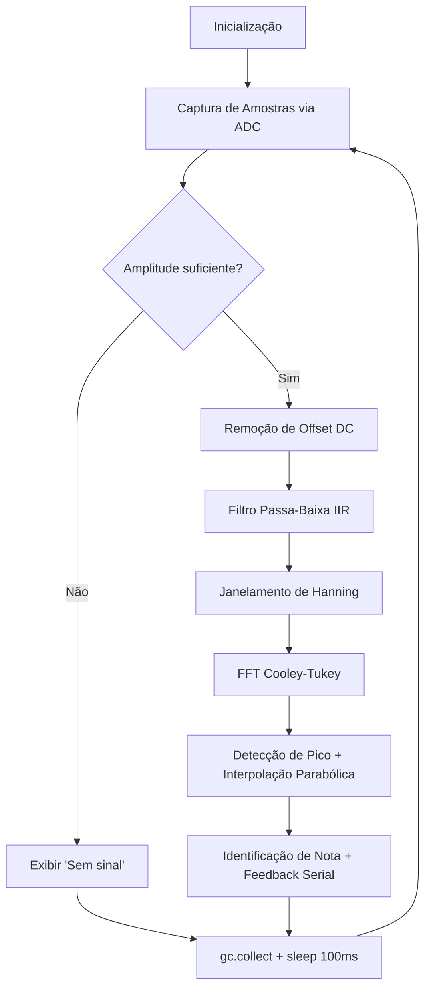
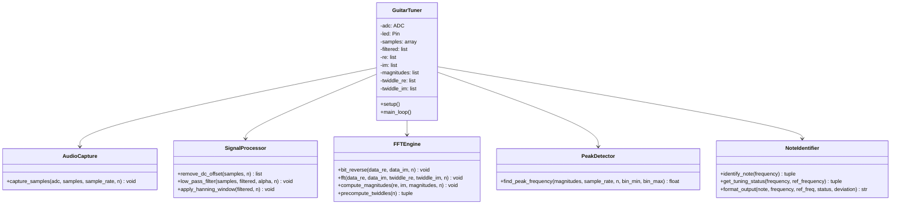

# Documento de Design — Afinador de Guitarra

## Visão Geral

Este documento descreve o design técnico do afinador de guitarra embarcado no Raspberry Pi Pico 2 (RP2350) com MicroPython. O sistema implementa um pipeline de processamento digital de sinais (DSP) que captura áudio via ADC, aplica filtragem passa-baixa IIR, janelamento de Hanning, FFT Cooley-Tukey radix-2 e interpolação parabólica para detectar a frequência fundamental de uma corda de guitarra. O resultado é comparado com as frequências da afinação padrão (E2–E4) e o feedback é exibido via serial USB.

O design prioriza eficiência de memória e processamento, respeitando as restrições do MicroPython vanilla (sem NumPy/ulab) e os 520 KB de SRAM do RP2350.

## Arquitetura

O sistema segue uma arquitetura de pipeline sequencial em loop contínuo. Cada ciclo executa as etapas na ordem fixa:



### Decisões Arquiteturais

1. **Pipeline sequencial single-core**: Simplicidade e previsibilidade. Não há necessidade de paralelismo — o pipeline completo deve executar em tempo menor que o intervalo entre ciclos.
2. **Arrays pré-alocados**: Toda memória é alocada no `setup()`. O loop principal opera in-place, sem alocações dinâmicas.
3. **FFT em Python puro**: Sem dependência de bibliotecas externas. Twiddle factors pré-calculados para evitar chamadas repetidas a `math.cos`/`math.sin`.
4. **Saída serial apenas**: Sem display LCD/OLED nesta versão. O feedback vai para `print()` via USB.

## Componentes e Interfaces

### Diagrama de Componentes




### Descrição dos Componentes

#### 1. AudioCapture — Captura de Amostras

Responsável por ler N amostras do ADC no pino 26 com timing preciso via `time.sleep_us()`.

- **Entrada**: Objeto ADC, array pré-alocado, taxa de amostragem, N
- **Saída**: Array preenchido com valores brutos do ADC (0–65535 via `read_u16()`)
- **Controle de timing**: `interval_us = 1_000_000 // SAMPLE_RATE` (250 µs para 4000 Hz)
- **Detecção de sinal**: Calcula amplitude pico-a-pico. Se < limiar (500), retorna flag indicando sinal insuficiente.

#### 2. SignalProcessor — Processamento do Sinal

Três operações sequenciais sobre o buffer de amostras:

**remove_dc_offset(samples, n)**:
- Calcula a média aritmética das N amostras
- Subtrai a média de cada amostra, centralizando o sinal em zero
- Retorna lista de floats

**low_pass_filter(samples, filtered, alpha, n)**:
- Filtro IIR de 1ª ordem: `y[i] = α·x[i] + (1-α)·y[i-1]`
- α = 0.386 (calculado para fc=400 Hz, fs=4000 Hz)
- Opera in-place no array `filtered` pré-alocado

**apply_hanning_window(filtered, n)**:
- Aplica janela de Hanning: `w[i] = 0.5 × (1 - cos(2πi/(N-1)))`
- Opera in-place sobre o array `filtered`
- Reduz vazamento espectral (spectral leakage) na FFT

#### 3. FFTEngine — Motor FFT

Implementação Cooley-Tukey radix-2 decimation-in-time (DIT):

**precompute_twiddles(n)**:
- Calcula `cos(2πk/N)` e `sin(2πk/N)` para k = 0..N/2-1
- Retorna duas listas (parte real e imaginária)
- Chamado uma única vez no `setup()`

**bit_reverse(data_re, data_im, n)**:
- Permutação bit-reversal dos índices
- Opera in-place nos arrays real e imaginário

**fft(data_re, data_im, twiddle_re, twiddle_im, n)**:
- Butterfly operations iterativas em log₂(N) estágios
- Usa twiddle factors pré-calculados
- Opera in-place

**compute_magnitudes(re, im, magnitudes, n)**:
- Calcula `|X[k]| = √(re[k]² + im[k]²)` para k = 0..N/2-1
- Apenas metade do espectro (simetria de sinais reais)

#### 4. PeakDetector — Detecção de Pico

**find_peak_frequency(magnitudes, sample_rate, n, bin_min, bin_max)**:
- Busca o bin de maior magnitude na faixa [bin_min, bin_max]
- `bin_min = int(70 × N / SAMPLE_RATE)` → ~36 (para N=2048)
- `bin_max = int(350 × N / SAMPLE_RATE)` → ~179 (para N=2048)
- Aplica interpolação parabólica no pico para refinar a frequência:
  ```
  p = 0.5 × (mag[k-1] - mag[k+1]) / (mag[k-1] - 2×mag[k] + mag[k+1])
  freq = (k + p) × SAMPLE_RATE / N
  ```
- Retorna frequência interpolada em Hz

#### 5. NoteIdentifier — Identificação de Nota

**identify_note(frequency)**:
- Compara a frequência com as 6 referências da afinação padrão
- Retorna a nota com menor diferença absoluta e sua frequência de referência

**get_tuning_status(frequency, ref_frequency)**:
- Calcula desvio: `deviation = frequency - ref_frequency`
- Se `|deviation| ≤ 1.0 Hz`: status = "Afinado"
- Se `deviation > 1.0 Hz`: status = "Sustenido (Sharp)"
- Se `deviation < -1.0 Hz`: status = "Bemol (Flat)"
- Retorna tupla (status, deviation)

**format_output(note, frequency, ref_freq, status, deviation)**:
- Formata string para saída serial:
  ```
  Nota: A2 | Freq: 111.5 Hz | Ref: 110.0 Hz | Status: Sustenido (+1.5 Hz)
  ```

## Modelos de Dados

### Constantes do Sistema

```python
SAMPLE_RATE = 4000          # Hz
N = 2048                    # Número de amostras (potência de 2)
FREQ_RESOLUTION = SAMPLE_RATE / N  # ~1.95 Hz
SAMPLE_INTERVAL_US = 1_000_000 // SAMPLE_RATE  # 250 µs
ALPHA = 0.386               # Coeficiente do filtro IIR (fc=400Hz)
SIGNAL_THRESHOLD = 500      # Limiar de amplitude pico-a-pico (16 bits)
TUNING_TOLERANCE = 1.0      # Hz
CYCLE_DELAY_MS = 100        # Intervalo entre ciclos
BIN_MIN = int(70 * N / SAMPLE_RATE)    # ~36
BIN_MAX = int(350 * N / SAMPLE_RATE)   # ~179
```

### Tabela de Afinação Padrão

```python
STANDARD_TUNING = [
    ("E2", 82.41),
    ("A2", 110.00),
    ("D3", 146.83),
    ("G3", 196.00),
    ("B3", 246.94),
    ("E4", 329.63),
]
```

### Estruturas de Dados em Memória

| Estrutura       | Tipo                    | Tamanho       | Descrição                              |
|-----------------|-------------------------|---------------|----------------------------------------|
| `samples`       | `array('H', ...)`       | N × 2 bytes   | Amostras brutas do ADC (unsigned short) |
| `signal`        | `list[float]`           | N × 8 bytes   | Sinal após remoção de DC offset        |
| `filtered`      | `list[float]`           | N × 8 bytes   | Sinal após filtro passa-baixa          |
| `re`            | `list[float]`           | N × 8 bytes   | Parte real da FFT                      |
| `im`            | `list[float]`           | N × 8 bytes   | Parte imaginária da FFT                |
| `magnitudes`    | `list[float]`           | (N/2) × 8 bytes | Magnitudes do espectro               |
| `twiddle_re`    | `list[float]`           | (N/2) × 8 bytes | Twiddle factors (cosseno)            |
| `twiddle_im`    | `list[float]`           | (N/2) × 8 bytes | Twiddle factors (seno)               |

**Estimativa de memória total** (N=2048): ~86 KB — bem dentro dos 520 KB de SRAM.


## Propriedades de Corretude

*Uma propriedade é uma característica ou comportamento que deve ser verdadeiro em todas as execuções válidas de um sistema — essencialmente, uma declaração formal sobre o que o sistema deve fazer. Propriedades servem como ponte entre especificações legíveis por humanos e garantias de corretude verificáveis por máquina.*

### Propriedade 1: Atenuação do filtro passa-baixa acima de 400 Hz

*Para qualquer* sinal senoidal puro com frequência acima de 400 Hz, após aplicar o filtro IIR passa-baixa (α=0.386), a amplitude do sinal filtrado deve ser significativamente menor que a amplitude do sinal original (atenuação > 50%).

**Valida: Requisito 3.1**

### Propriedade 2: Preservação da banda passante do filtro (70–350 Hz)

*Para qualquer* sinal senoidal puro com frequência entre 70 Hz e 350 Hz, após aplicar o filtro IIR passa-baixa, a amplitude do sinal filtrado deve ser preservada sem atenuação significativa (perda < 30%).

**Valida: Requisito 3.3**

### Propriedade 3: Precisão da detecção de frequência (FFT + pico)

*Para qualquer* sinal senoidal puro com frequência f na faixa [70, 350] Hz, o pipeline completo (remoção de DC offset → filtro IIR → janela de Hanning → FFT → detecção de pico com interpolação parabólica) deve retornar uma frequência estimada dentro de ±2 Hz da frequência real f.

**Valida: Requisitos 4.1, 4.3**

### Propriedade 4: Identificação da nota mais próxima

*Para qualquer* frequência na faixa [70, 350] Hz, a função `identify_note` deve retornar a nota da afinação padrão (E2, A2, D3, G3, B3, E4) cuja frequência de referência tem a menor diferença absoluta em relação à frequência de entrada.

**Valida: Requisitos 5.1, 5.2**

### Propriedade 5: Classificação correta do status de afinação

*Para qualquer* frequência detectada e sua nota de referência mais próxima, a função `get_tuning_status` deve classificar como "Afinado" se |desvio| ≤ 1.0 Hz, como "Sustenido (Sharp)" se desvio > 1.0 Hz, e como "Bemol (Flat)" se desvio < -1.0 Hz.

**Valida: Requisitos 6.1, 6.2, 6.3**

### Propriedade 6: Completude do formato de saída

*Para qualquer* resultado válido de identificação de nota (nota, frequência medida, frequência de referência, status, desvio), a string formatada por `format_output` deve conter todos os cinco campos: nome da nota, frequência medida em Hz, frequência de referência em Hz, status da afinação e desvio em Hz.

**Valida: Requisito 6.4**

### Propriedade 7: Detecção de sinal insuficiente

*Para qualquer* conjunto de N amostras onde a amplitude pico-a-pico (máximo - mínimo) é menor que o limiar SIGNAL_THRESHOLD (500), a função de detecção de sinal deve retornar `False`, indicando sinal insuficiente.

**Valida: Requisito 8.1**

## Tratamento de Erros

### Estratégia Geral

O sistema adota uma abordagem defensiva: o loop principal é envolvido em `try/except` para garantir que nenhuma exceção interrompa a operação contínua.

### Cenários de Erro

| Cenário | Causa Provável | Tratamento |
|---------|---------------|------------|
| Exceção na leitura do ADC | Hardware desconectado ou falha elétrica | Log do erro via `print()`, continuar no próximo ciclo |
| Sinal insuficiente | Nenhuma corda tocada ou microfone com problema | Exibir "Sem sinal detectado", pular FFT, retornar ao início |
| Exceção na FFT | Overflow numérico em sinais muito altos | Log do erro, `gc.collect()`, continuar |
| Memória insuficiente | Fragmentação após muitos ciclos | `gc.collect()` entre ciclos; se persistir, log e continuar |
| Pico não encontrado na faixa | Sinal fora da faixa 70–350 Hz | Tratar como sinal insuficiente |

### Padrão de Resiliência no Loop Principal

```python
while True:
    try:
        # pipeline completo
        ...
    except Exception as e:
        print(f"Erro: {e}")
    finally:
        gc.collect()
        time.sleep_ms(CYCLE_DELAY_MS)
```

## Estratégia de Testes

### Abordagem Dual: Testes Unitários + Testes Baseados em Propriedades

O projeto utiliza duas abordagens complementares de teste:

1. **Testes unitários**: Verificam exemplos específicos, casos de borda e condições de erro
2. **Testes baseados em propriedades (PBT)**: Verificam propriedades universais com entradas geradas aleatoriamente

Ambos são necessários para cobertura abrangente — testes unitários capturam bugs concretos, testes de propriedade verificam corretude geral.

### Biblioteca de Testes Baseados em Propriedades

- **Biblioteca**: `hypothesis` (Python)
- **Justificativa**: Biblioteca madura e amplamente utilizada para PBT em Python. Os testes serão executados no host (PC), não no Pico, pois o MicroPython não suporta Hypothesis. O código de lógica (filtro, FFT, detecção de nota) será testado isoladamente no host.
- **Configuração**: Mínimo de 100 iterações por teste de propriedade (`@settings(max_examples=100)`)

### Testes Unitários

Focados em:
- Exemplos específicos com frequências conhecidas (ex.: sinal de 110 Hz → nota A2)
- Casos de borda: frequência exatamente no limiar de tolerância (±1.0 Hz)
- Condições de erro: array vazio, sinal zerado, frequência fora da faixa
- Verificação de constantes: SAMPLE_RATE ≥ 800, N é potência de 2
- Inicialização de hardware: ADC no pino 26, LED no pino 25

### Testes Baseados em Propriedades

Cada propriedade de corretude (seção anterior) será implementada como um **único teste de propriedade** usando Hypothesis:

| Propriedade | Tag do Teste |
|-------------|-------------|
| Propriedade 1 | `Feature: guitar-tuner, Property 1: Atenuação do filtro passa-baixa acima de 400 Hz` |
| Propriedade 2 | `Feature: guitar-tuner, Property 2: Preservação da banda passante do filtro (70–350 Hz)` |
| Propriedade 3 | `Feature: guitar-tuner, Property 3: Precisão da detecção de frequência (FFT + pico)` |
| Propriedade 4 | `Feature: guitar-tuner, Property 4: Identificação da nota mais próxima` |
| Propriedade 5 | `Feature: guitar-tuner, Property 5: Classificação correta do status de afinação` |
| Propriedade 6 | `Feature: guitar-tuner, Property 6: Completude do formato de saída` |
| Propriedade 7 | `Feature: guitar-tuner, Property 7: Detecção de sinal insuficiente` |

### Geração de Dados de Teste

- **Sinais senoidais**: Gerar com `math.sin(2π·f·t)` para frequências aleatórias na faixa de interesse
- **Frequências**: `hypothesis.strategies.floats(min_value=70.0, max_value=350.0)`
- **Amostras de baixa amplitude**: Arrays com valores próximos ao offset DC (32768 ± amplitude < 250)
- **Strings de nota**: Geradas a partir das 6 notas padrão com desvios aleatórios

### Execução dos Testes

Os testes rodam no **host (PC com CPython)**, não no Raspberry Pi Pico. O código de lógica pura (sem dependência de `machine` ou hardware) é importado e testado diretamente. Mocks são usados para `machine.ADC` e `machine.Pin` nos testes de integração.

```bash
# Executar todos os testes
pytest tests/ -v

# Executar apenas testes de propriedade
pytest tests/ -v -k "property"
```
